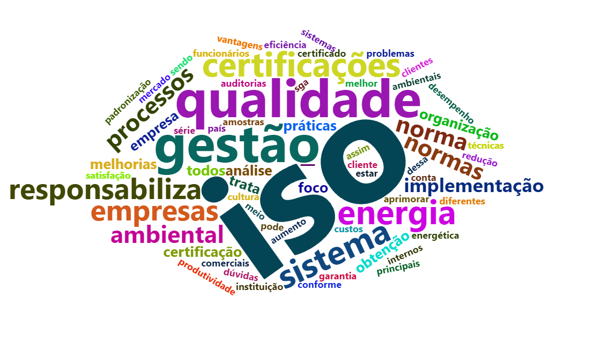

```{r setup, include=FALSE}
options(htmltools.dir.version = FALSE)
```

```{r xaringan-themer, include=FALSE, warning=FALSE}
library(xaringanthemer)
style_duo_accent(
  primary_color = "#1381B0",
  secondary_color = "#FF961C",
  inverse_header_color = "#FFFFFF"
)
```


# Normalização

```{r echo=FALSE, message=FALSE, warning=FALSE}

```

---
## Pequenas e grandes empresas

## Funções organizacionais

## O que é auditoria?

## Treinamento

---
# Procedimento Operacional

- Nome do procedimento;
- Local de aplicação;
- Responsáveis pela tarefa (cargos);
- Responsável pela elaboração do POP;
- Materiais envolvidos na tarefa;
- Documentação de referência, como manuais, estatuto, guias de segurança e assim por diante;
- Siglas devidamente descritas;
- Passo a passo do procedimento, incluindo etapas e sequência de realização, além da nomeação dos responsáveis por cada etapa;
- Gráficos e fluxogramas, no caso de tarefas com alto grau de complexidade;
- Perspectiva de revisão, ou seja, dentro de qual período o POP precisará ser revisado. 

---
class: inverse, center, middle

# Dúvidas?


